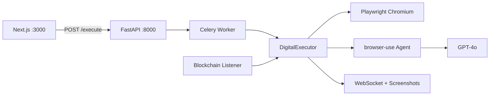

# PassageHack Release Readiness Report

**Generated:** June 26, 2026  
**Branch:** `release/readiness-audit-step1`  
**Purpose:** Pre-public-launch audit covering browser automation, feature completeness, security, caching, tests, and prioritized backlog.

---

## Executive Summary

PassageHack (branded **Passage** on frontend, **Project Charon** on backend/contracts) is a digital estate management platform combining smart contracts, Lit Protocol encryption, AI browser automation, and guardian workflows.

| Area | Status | Notes |
|------|--------|-------|
| Smart contracts | **Production-ready** | ~36 Hardhat tests |
| AI executor backend | **Production-ready** | Playwright + browser-use + GPT-4o |
| Frontend auth (Privy/Wagmi) | **Complete** | Client-side only |
| Digital Will | **Fixed in Step 1** | Lit encryption + backend API |
| Memory Vault | **Fixed in Step 1** | Backend IPFS URL corrected |
| Asset Recovery | **Fixed in Step 1** | API path/response mapping |
| Backend security | **Improved in Step 1** | API key on sensitive routes |
| Tests & CI | **Added in Step 1** | pytest, Vitest, GitHub Actions |
| Time capsules / vault deposits | **Deferred** | Post-launch |

---

## 1. Browser Automation Analysis

### Current Stack

| Component | Version (before Step 1) | Version (after Step 1) |
|-----------|-------------------------|------------------------|
| Playwright | 1.40.0 | 1.49.1 |
| browser-use | 0.1.0 | 0.1.40 |
| LLM | GPT-4o (default) | GPT-4o + optional gpt-4o-mini tier |

### Recommendation: Keep Playwright + browser-use

| Option | Verdict | Rationale |
|--------|---------|-----------|
| **Playwright + browser-use** | **Keep** | Entire Python/FastAPI/Celery stack built on it; session injection (cookies, localStorage, TOTP) implemented |
| **Vercel agent-browser** | **Not relevant** | Rust CLI for coding agents (Cursor/Claude Code), not a Python backend framework |
| **Stagehand (TypeScript/CDP)** | **Only if rewriting backend** | Action caching reduces LLM cost; requires full Node rewrite |
| **Skyvern** | **Overkill** | Enterprise RPA; heavy migration |
| **Raw Playwright only** | **Partial** | Good for deterministic flows; insufficient for open-ended estate tasks |

### AI Model Note

The system uses **GPT-4o exclusively** — not weak models. Step 1 adds optional `OPENAI_MODEL_MINI` for future cost optimization on simple subtasks.

### Efficiency Improvements (Step 1 + Backlog)

| Item | Status | Location |
|------|--------|----------|
| Upgrade Playwright/browser-use pins | Done | `backend/requirements.txt` |
| Enforce `BROWSER_TIMEOUT` | Done | `backend/agent/executor.py` |
| Model tiering config | Done | `backend/core/config.py` |
| Parallel recovery searches | Backlog | `backend/agent/recovery_agent.py` |
| Remote browser pool (Browserless) | Backlog | Production scale |
| Wire or remove dead code | Documented | See §6 |

---

## 2. Feature Completeness Matrix

### Complete / Production-Ready

| Feature | Files |
|---------|-------|
| Smart contracts | `contracts/contracts/CharonSwitch.sol`, `AssetTransfer.sol` |
| Onboarding + on-chain register | `frontend/app/onboarding/page.tsx` |
| Dashboard pulse / status | `frontend/app/dashboard/page.tsx` |
| Guardian portal | `frontend/app/guardian/[userId]/page.tsx` |
| AI executor + Celery | `backend/agent/executor.py`, `backend/services/tasks.py` |
| Privy + Wagmi auth | `frontend/app/providers.tsx` |

### Fixed in Step 1 (P0)

| Issue | File | Fix Applied |
|-------|------|-------------|
| Recovery API path wrong | `frontend/app/dashboard/recovery/page.tsx` | `/api/recovery/search`; map `total_assets` |
| WebSocket hits Next.js | `frontend/hooks/useWebSocket.ts` | Default to backend host via env |
| IPFS upload hits Next.js | `frontend/utils/memoryStorage.ts` | Use `NEXT_PUBLIC_BACKEND_URL` |
| Digital Will plaintext localStorage | `frontend/app/dashboard/will/page.tsx` | Lit encrypt + `POST /api/wills` |
| Memory upload broken | `frontend/utils/memoryStorage.ts` | Backend URL + API key header |

### Improved in Step 1 (P1)

| Feature | Work Done |
|---------|-----------|
| Backend auth | API key middleware on `/execute`, `/api/recovery/*`, `/api/ipfs/upload`, `/api/wills` |
| Task ID mapping | Redis-backed with in-memory fallback |
| Will storage API | `POST/GET/DELETE /api/wills` |
| Redis in Docker | Added to `backend/docker-compose.yml` |
| Emergency verification ABI | Added to `frontend/lib/contracts.ts` |

### Partial / Mock (Post-Launch)

| Feature | Status | Notes |
|---------|--------|-------|
| Lit backend decrypt | Stub | `backend/services/lit_decrypt.py` returns placeholder |
| Blockchain death listener | Partial | Uses will service; decrypt still stub |
| Crypto vault deposits | UI only | Beneficiary setup works; no deposit flow |
| Time capsules | Encrypt only | No delivery pipeline |
| Privacy / admin pages | Demo data | Mark as demo-only |
| Email notifications | Log-only | Requires Resend/SendGrid keys |
| Memory book generator | Unwired | `backend/agent/memory_scraper.py` |

---

## 3. Security Findings

### Addressed in Step 1

- API key authentication on sensitive backend routes
- Removed plaintext password storage from Digital Will page
- Added `backend/dump.rdb` to `.gitignore`
- Frontend sends `Authorization: Bearer` header for protected API calls

### Remaining Risks (Post-Launch)

| Risk | Severity | Mitigation |
|------|----------|------------|
| `NEXT_PUBLIC_API_KEY` exposed in browser | Medium | Move to Next.js API route proxy |
| WebSocket has no auth | Medium | Add token query param or session validation |
| Screenshots publicly accessible | Medium | Require auth or signed URLs |
| Lit on Mumbai testnet | Low | Migrate to mainnet before production |
| Postgres in Docker unused | Low | Wire app to Postgres or remove service |
| SSN sent to recovery API | High | Encrypt in transit; minimize retention |

### Required Environment Variables

**Frontend (`frontend/.env.local`):**
- `NEXT_PUBLIC_PRIVY_APP_ID`
- `NEXT_PUBLIC_BACKEND_URL` (e.g. `http://localhost:8000`)
- `NEXT_PUBLIC_WS_HOST` (e.g. `localhost:8000`)
- `NEXT_PUBLIC_API_KEY`
- `NEXT_PUBLIC_CHARON_SWITCH_ADDRESS`
- `NEXT_PUBLIC_ASSET_TRANSFER_ADDRESS`
- Chain RPC URLs (optional, for rate-limit avoidance)

**Backend (`backend/.env`):**
- `OPENAI_API_KEY`
- `API_KEY` (must match frontend)
- `RPC_URL`, `CHARON_SWITCH_ADDRESS`
- `CELERY_BROKER_URL`, `CELERY_RESULT_BACKEND` (Redis)
- `PINATA_API_KEY`, `PINATA_SECRET_KEY` (optional; mock hash without)
- `RESEND_API_KEY` or `SENDGRID_API_KEY` (optional; log-only without)

---

## 4. Caching & Performance

### Current Architecture

| Layer | Mechanism | Notes |
|-------|-----------|-------|
| Celery | Redis broker/backend | Task queue + results |
| Task mapping | Redis keys `execution:{id}:task_id` | 24h TTL |
| Will storage | Redis + in-memory fallback | Persists across restarts when Redis available |
| React Query | 30s staleTime, 5min gcTime | `frontend/app/providers.tsx` |
| Lit client | New connection per operation | Backlog: singleton pool |
| Recovery searches | Serial browser tasks | Backlog: parallelize with `asyncio.gather` |

### Performance Concerns

- Heavy frontend bundle: Privy, Wagmi, viem, ethers, lit-js-sdk
- Backend Docker image includes Playwright + Chromium (large cold start)
- Celery `worker_max_tasks_per_child=50` mitigates browser memory leaks
- No route-level `dynamic()` imports in frontend

---

## 5. Tests & CI

### Added in Step 1

| Layer | Tool | Coverage |
|-------|------|----------|
| Contracts | Hardhat (existing) | ~36 tests |
| Backend | pytest + httpx | Health, auth, recovery contract, task mapping |
| Frontend | Vitest | WebSocket URL, API client |
| CI | GitHub Actions | contracts + backend + frontend lint/build/test |

### Backlog

- E2E Playwright tests against mock sites
- WebSocket integration tests
- Contract tests for `ChainlinkOracle.sol`
- Coverage reporting in CI

---

## 6. Unwired Dead Code

Consider removing or wiring in a future cleanup pass:

| File | Purpose |
|------|---------|
| `backend/agent/memory_scraper.py` | Google Photos / Facebook scraper |
| `backend/agent/demo_executor.py` | Mock site redirect executor |
| `backend/app/agent.py` | Legacy BrowserAgent wrapper |
| `frontend/components/DigitalWillForm.tsx` | Superseded by `will/page.tsx` |
| `frontend/components/RecoveryDashboard.tsx` | Superseded by recovery page |
| `frontend/components/onboarding/OnboardingWizard.tsx` | Superseded by onboarding page |
| `frontend/components/EstateDashboard.tsx` | Calls nonexistent API routes |

---

## 7. Prioritized Backlog

### P0 — Done in Step 1
- [x] Recovery API path fix
- [x] WebSocket host fix
- [x] IPFS upload URL fix
- [x] Digital Will Lit encryption + backend API
- [x] API key auth
- [x] Redis task mapping
- [x] Test/CI foundation

### P1 — Next Sprint
- [ ] Next.js API route proxy (hide API key from browser)
- [ ] WebSocket authentication
- [ ] Real Lit backend decrypt (replace stub)
- [ ] Connect blockchain listener to Redis will store
- [ ] Parallel recovery agent searches
- [ ] Lit client singleton / connection pooling

### P2 — Post-Launch
- [ ] Postgres migration (replace mock DB)
- [ ] Crypto vault token deposit UI
- [ ] Time capsule delivery pipeline
- [ ] Remote browser farm (Browserless)
- [ ] Lit mainnet migration
- [ ] Full E2E test suite
- [ ] Remove dead code modules

---

## 8. Launch Checklist

Before going public, verify:

- [ ] All env vars set in production
- [ ] Redis running (Celery + task mapping + wills)
- [ ] Celery worker running with Playwright Chromium installed
- [ ] Contract addresses deployed and configured
- [ ] Pinata credentials for real IPFS uploads
- [ ] `API_KEY` set and matching frontend/backend
- [ ] Demo/admin pages labeled or hidden
- [ ] CI passing on main branch

---

*This report reflects the codebase after Step 1 implementation on branch `release/readiness-audit-step1`.*
